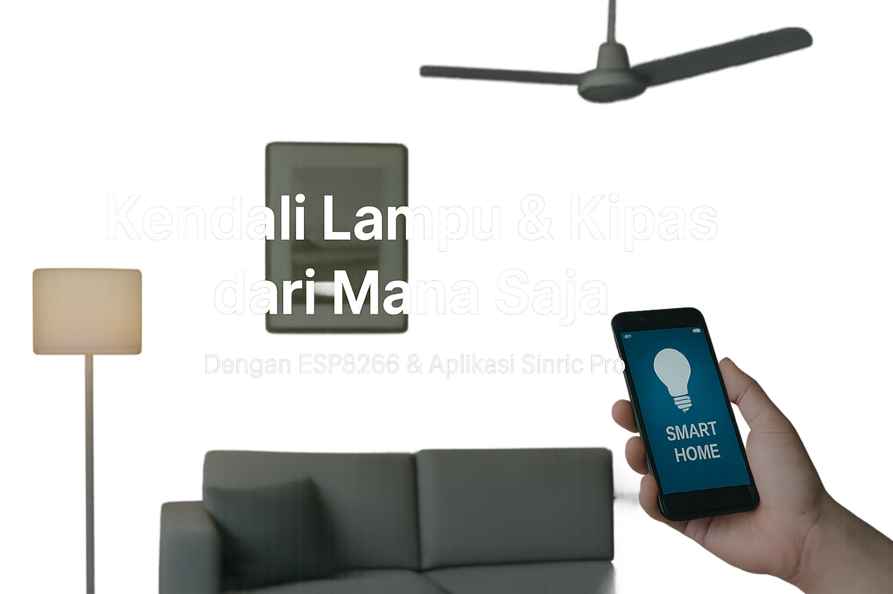

# 🌟 Smart LAB Website (Bootstrap Version)

Website promosi **Smart LAB** untuk mengontrol lampu & kipas jarak jauh menggunakan **ESP8266 + aplikasi Sinric Pro**.  
Dibuat dengan **HTML + Bootstrap 5**, mudah dikembangkan dan tampil modern responsif.

---

## 🚀 Tampilan Website

### Hero Banner


### Logo Produk


### Galeri Produk


---

## 📄 Kode Lengkap Website (`index.html`)

```html
<!DOCTYPE html>
<html lang="id">
<head>
  <meta charset="UTF-8">
  <meta name="viewport" content="width=device-width, initial-scale=1">
  <title>Smart LAB - Kendali Lampu & Kipas Jarak Jauh</title>
  <!-- Bootstrap CSS -->
  <link href="https://cdn.jsdelivr.net/npm/bootstrap@5.3.2/dist/css/bootstrap.min.css" rel="stylesheet">
  <link rel="stylesheet" href="style.css">
</head>
<body>

<!-- Navbar -->
<nav class="navbar navbar-expand-lg navbar-dark bg-dark fixed-top">
  <div class="container">
    <a class="navbar-brand d-flex align-items-center" href="#">
      
      <span>Smart LAB</span>
    </a>
    <button class="navbar-toggler" type="button" data-bs-toggle="collapse" data-bs-target="#navbarNav">
      <span class="navbar-toggler-icon"></span>
    </button>
    <div class="collapse navbar-collapse" id="navbarNav">
      <ul class="navbar-nav ms-auto">
        <li class="nav-item"><a class="nav-link" href="#home">Beranda</a></li>
        <li class="nav-item"><a class="nav-link" href="#fitur">Fitur</a></li>
        <li class="nav-item"><a class="nav-link" href="#galeri">Galeri</a></li>
        <li class="nav-item"><a class="nav-link" href="#kontak">Kontak</a></li>
      </ul>
    </div>
  </div>
</nav>

<!-- Hero -->
<header id="home" class="hero d-flex align-items-center text-center text-white">
  <div class="container">
    <h1 class="display-4 fw-bold">Kendali Lampu & Kipas dari Mana Saja</h1>
    <p class="lead">Dengan ESP8266 & Aplikasi Sinric Pro</p>
    <a href="#kontak" class="btn btn-warning btn-lg mt-3">Pesan Sekarang</a>
  </div>
</header>

<!-- Fitur -->
<section id="fitur" class="py-5 bg-light text-center">
  <div class="container">
    <h2 class="mb-4">Fitur Utama</h2>
    <div class="row">
      <div class="col-md-4">
        <div class="card shadow-sm p-4">
          
          <h5>Terkoneksi WiFi</h5>
          <p>Kendali perangkat rumah Anda dengan internet.</p>
        </div>
      </div>
      <div class="col-md-4">
        <div class="card shadow-sm p-4">
          
          <h5>Aplikasi Sinric Pro</h5>
          <p>Kontrol mudah dengan smartphone Android/iOS.</p>
        </div>
      </div>
      <div class="col-md-4">
        <div class="card shadow-sm p-4">
          
          <h5>Otomatisasi</h5>
          <p>Atur jadwal nyala/mati lampu dan kipas.</p>
        </div>
      </div>
    </div>
  </div>
</section>

<!-- Galeri -->
<section id="galeri" class="py-5 text-center">
  <div class="container">
    <h2 class="mb-4">Galeri Produk</h2>
    <div id="carouselExample" class="carousel slide" data-bs-ride="carousel">
      <div class="carousel-inner rounded shadow">
        <div class="carousel-item active">
          
        </div>
        <div class="carousel-item">
          
        </div>
        <div class="carousel-item">
          
        </div>
      </div>
      <button class="carousel-control-prev" type="button" data-bs-target="#carouselExample" data-bs-slide="prev">
        <span class="carousel-control-prev-icon"></span>
      </button>
      <button class="carousel-control-next" type="button" data-bs-target="#carouselExample" data-bs-slide="next">
        <span class="carousel-control-next-icon"></span>
      </button>
    </div>
  </div>
</section>

<!-- Kontak -->
<section id="kontak" class="py-5 bg-dark text-white text-center">
  <div class="container">
    <h2 class="mb-3">Hubungi Kami</h2>
    <p>Email: <a href="mailto:smartlab@gmail.com" class="text-warning">smartlab@gmail.com</a></p>
    <p>WhatsApp: <a href="https://wa.me/6281234567890" target="_blank" class="text-warning">+62 812-3456-7890</a></p>
  </div>
</section>

<!-- Footer -->
<footer class="bg-black text-white text-center py-3">
  <p>&copy; 2025 Smart LAB. All rights reserved.</p>
</footer>

<!-- Bootstrap JS -->
<script src="https://cdn.jsdelivr.net/npm/bootstrap@5.3.2/dist/js/bootstrap.bundle.min.js"></script>
</body>
</html>
