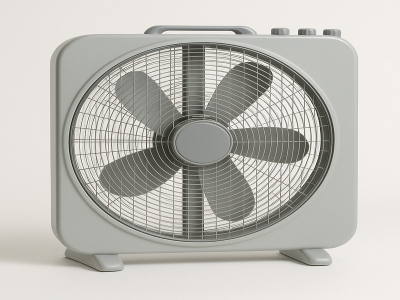
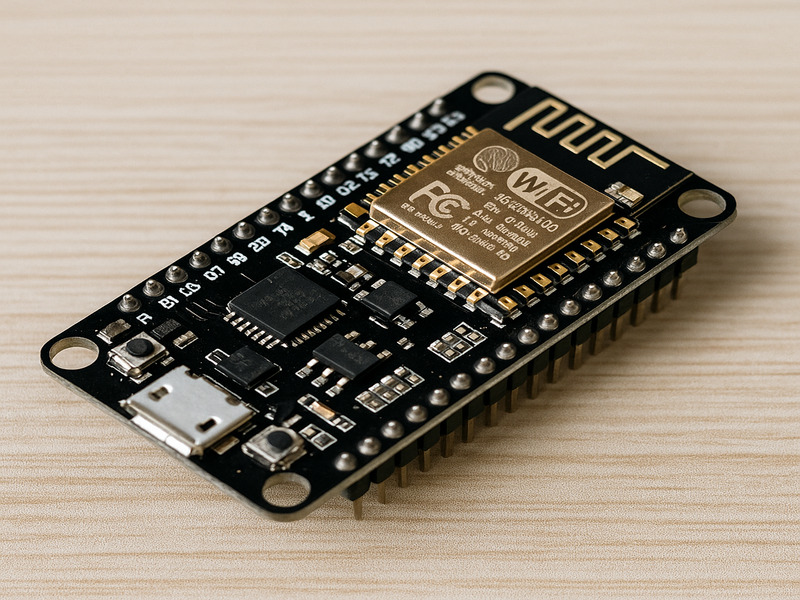

# 🌟 Smart LAB Website

Website promosi **Smart LAB** untuk mengontrol lampu & kipas jarak jauh menggunakan **ESP8266 + aplikasi Sinric Pro**.  
Dibuat dengan **HTML, CSS, dan JavaScript** (bisa dikembangkan dengan Bootstrap).

---

## 🚀 Tampilan Website

### Hero Banner


### Logo Produk


### Galeri Produk




---

## 📄 Kode Lengkap Website (`index.html`)

```html
<!DOCTYPE html>
<html lang="id">
<head>
  <meta charset="UTF-8">
  <meta name="viewport" content="width=device-width, initial-scale=1.0">
  <title>Smart LAB - Kontrol Lampu & Kipas Jarak Jauh</title>
  <link rel="stylesheet" href="style.css">
</head>
<body>
  <!-- Header -->
  <header>
    <div class="logo">
      
      <h1>Smart LAB</h1>
    </div>
    <nav>
      <ul>
        <li><a href="#home">Beranda</a></li>
        <li><a href="#fitur">Fitur</a></li>
        <li><a href="#galeri">Galeri</a></li>
        <li><a href="#kontak">Kontak</a></li>
      </ul>
    </nav>
  </header>

  <!-- Hero -->
  <section id="home" class="hero">
    <h2>Kendalikan Lampu & Kipas dari Mana Saja</h2>
    <p>Produk Smart LAB berbasis ESP8266 & aplikasi Sinric Pro.</p>
    <a href="#kontak" class="btn">Pesan Sekarang</a>
  </section>

  <!-- Fitur -->
  <section id="fitur" class="features">
    <h2>Fitur Utama</h2>
    <div class="feature-box">
      
      <h3>Terkoneksi WiFi</h3>
      <p>Kendali perangkat rumah Anda dengan jaringan internet.</p>
    </div>
    <div class="feature-box">
      
      <h3>Aplikasi Sinric Pro</h3>
      <p>Kontrol mudah menggunakan smartphone Android/iOS.</p>
    </div>
    <div class="feature-box">
      
      <h3>Otomatisasi</h3>
      <p>Atur jadwal nyala/mati untuk lampu dan kipas.</p>
    </div>
  </section>

  <!-- Galeri -->
  <section id="galeri" class="gallery">
    <h2>Galeri Produk</h2>
    <div class="slideshow-container">
      <div class="slide fade">
        
      </div>
      <div class="slide fade">
        
      </div>
      <div class="slide fade">
        
      </div>
    </div>
  </section>

  <!-- Kontak -->
  <section id="kontak" class="contact">
    <h2>Hubungi Kami</h2>
    <p>Email: <a href="mailto:smartlab@gmail.com">smartlab@gmail.com</a></p>
    <p>WhatsApp: <a href="https://wa.me/6281234567890" target="_blank">+62 812-3456-7890</a></p>
  </section>

  <!-- Footer -->
  <footer>
    <p>&copy; 2025 Smart LAB. All rights reserved.</p>
  </footer>
</body>
</html>
